# Proyecto no. 2 - Material Extra
# Índice:
1. [Máquina M01PC1 - Producto Audífonos Bluetooth](#máquina-m01pc1---producto-audífonos-bluetooth) 
2. [Máquina M01PC2 - Producto Mouse Inalámbrico](#máquina-m01pc2---producto-mouse-inalámbrico)
3. [Super Máquina 3000 - CPU](#super-máquina-3000---cpu)
4. [Super Máquina 3000 - Monitor](#super-máquina-3000---monitor)
 

### Máquina M01PC2 - Producto Audífonos Bluetooth
Se tiene la solución como:
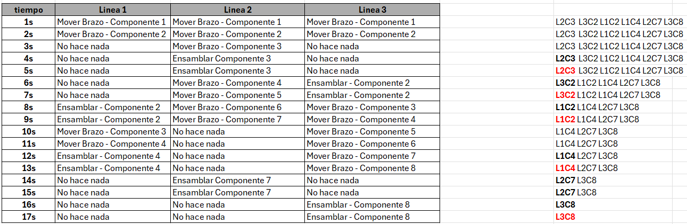 
 

Si se pidiera la solución en un tiempo, "t", se podría tener por ejemplo:
 

**t=5**:
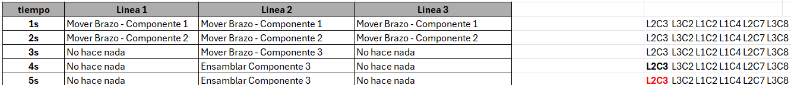 
 

Y el gráfico (Graphviz):
 
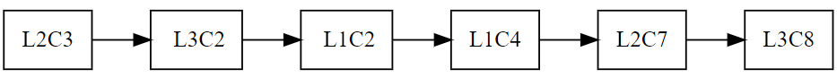 
 

### Máquina M01PC2 - Producto Mouse Inalámbrico
Se tiene la solución como:
 
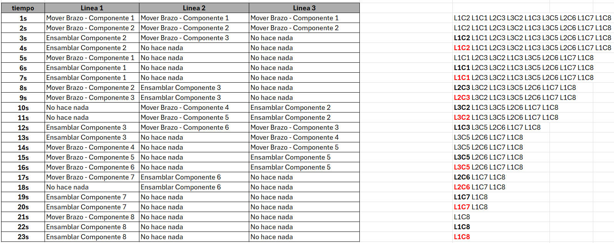 
 

Si se pidiera la solución en un tiempo, "t", se podría tener por ejemplo:
 

**t=2**:
 
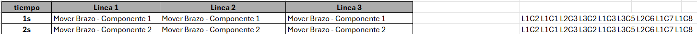 
 

Y el gráfico (Graphviz):
 
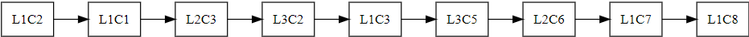 
 

### Super Máquina 3000 - CPU
Se tiene la solución como:
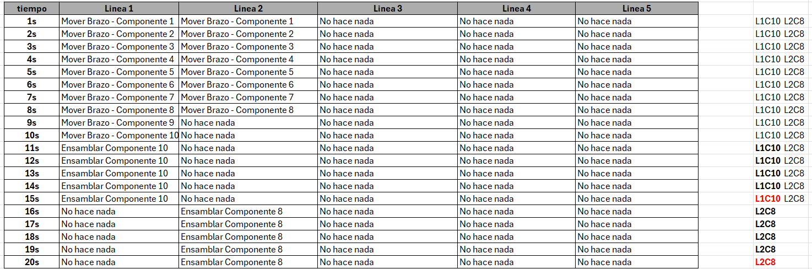 
 

Si se pidiera la solución en un tiempo, "t", se podría tener por ejemplo:
 

**t=25**:
Puede verse que el tiempo óptimo es de 20s, pero es posible que se pida un número mayor, el resultado del gráfico dará una imagen en blanco, ya que no existen componentes en la cola dado que todos han sido ensamblados - la tabla de pasos mostrará que los brazos seguirán sin hacer nada:
 
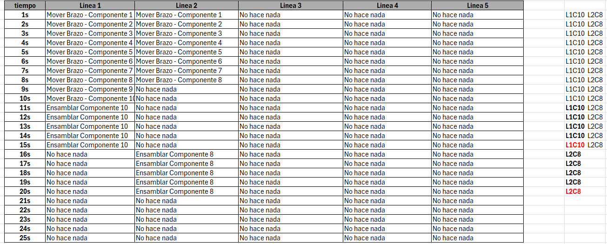 
 

Gráfico (Graphviz):
 
 
 

### Super Máquina 3000 - Monitor
 
Se tiene la solución como:
 
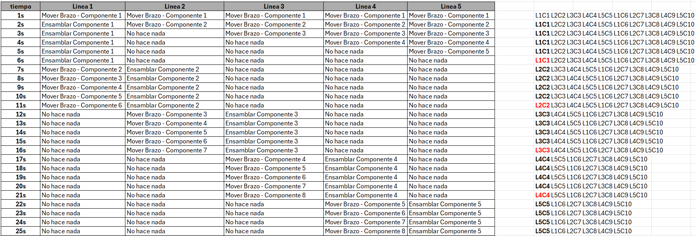 
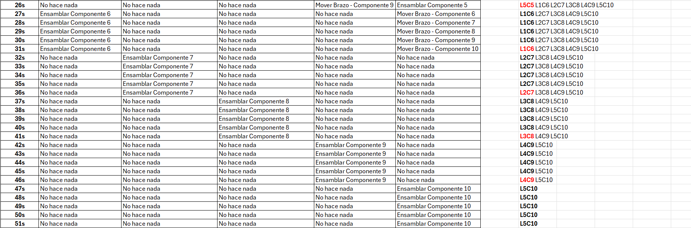 

 
Si se pidiera la solución en un tiempo, "t", se podría tener por ejemplo:
 

**t=45**:
 
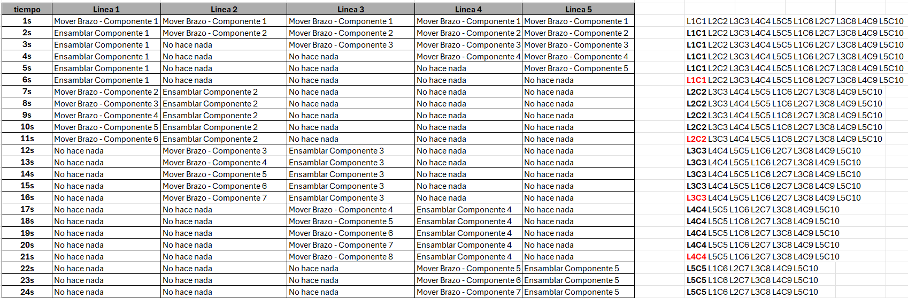
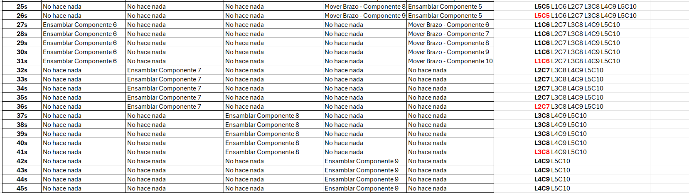 
 
Y el gráfico (Graphviz):
 
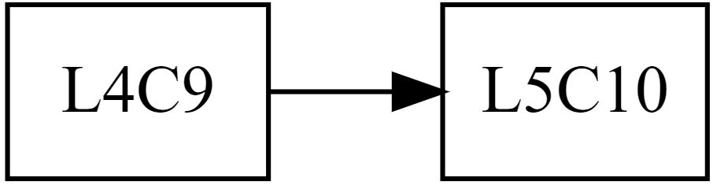 
 
